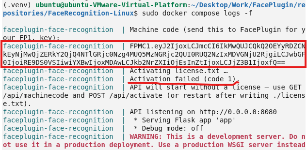
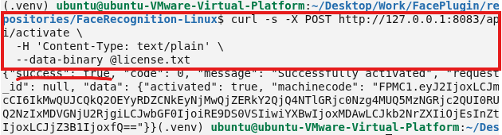
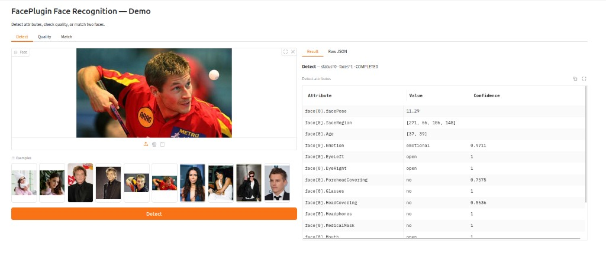
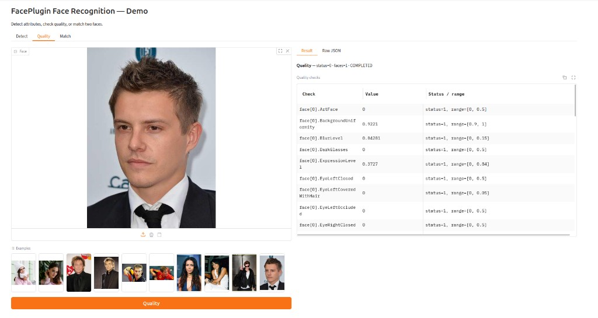
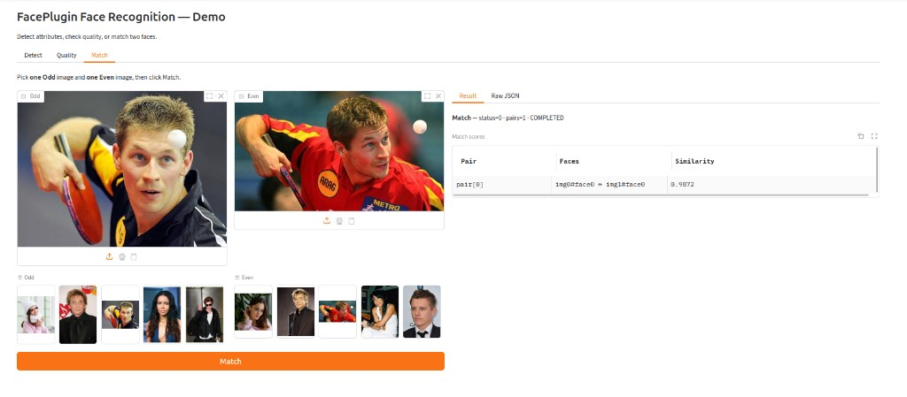

<div align="center">

</div>

#### 🌐 Company Site - [Here](https://faceplugin.com)
#### 🤗 Hugging Face - [Here](https://huggingface.co/FacePlugin-Ltd)
#### 🛟 Help Center - [Here](https://doc.faceplugin.com)
#### 🐳 Docker Hub - [Here](https://hub.docker.com/r/faceplugin/face-recognition)

# FacePlugin Face Recognition SDK — Linux / Docker (Fully On-Premise)

> **Ready in minutes:** `docker pull` → copy `FPMC1.…` from logs → `curl /api/health`.  
> Jump: [Quick Start](#quick-start) · [Start the API](#start-the-api) · [SDK License](#sdk-license) · [Setup on your own app](#setup-on-your-own-app) · [Try it](#try-it)

## Quick Start

- [ ] Download and run the appropriate Docker image from [FacePlugin Docker Hub](https://hub.docker.com/r/faceplugin/face-recognition). [See Option A for details](#option-a--docker-hub-no-drive-download).
- [ ] **Confirm it is running:** `curl -s http://127.0.0.1:8083/api/health` (no license needed yet)
- [ ] [Contact us](#contact) with your machine code (`FPMC1.…`) to obtain a license key, then activate with `POST /api/activate` — [SDK License](#sdk-license)
- [ ] **Try it:** Postman, curl, or local Gradio demo on **9003** (`demo.py`)

Docs: [https://doc.faceplugin.com](https://doc.faceplugin.com)

## Introduction

FacePlugin **Face Recognition SDK for Linux / Docker** is a fully on-premise biometric engine for KYC, access control, and identity verification. It runs face detection (bounding box, landmarks, pose, attributes), ICAO-style face quality, template extraction, 1:1 matching, and feature similarity — all on your server.

This repository is **standalone**. Pull Docker Hub (no Drive) or download the runtime into this repo and run — **no other FacePlugin repository is required**.

All processing stays on your server. **No** biometric data is sent to FacePlugin cloud — built for banking, eKYC, and on-premise compliance workflows.

**One repository** for Linux SDK + Docker. Native libraries are **linux/amd64**; the Docker image runs on Linux, Windows, and macOS hosts via Docker (Apple Silicon uses amd64 emulation). This product is **CPU-only**.

Test with Postman, curl, or the local Gradio demo (`demo.py`) covering Detect, Quality, and Match. Docs: [https://doc.faceplugin.com](https://doc.faceplugin.com).

### Main Functionalities

| Feature | API |
| ------- | --- |
| Face detection (bounding box, landmarks, pose, attributes) | `POST /api/detect` · `sdk.detect` |
| Face quality analysis (ICAO-style checks) | `POST /api/quality` · `sdk.quality` |
| Face template extraction for matching | `POST /api/feature` · `sdk.feature` |
| 1:1 face match (two images) | `POST /api/match` · `sdk.match` |
| Feature vector similarity scoring | `POST /api/similarity` · `sdk.similarity` |
| Health / machine code / activate | `GET /api/health` · `GET /api/machinecode` · `POST /api/activate` |

### Product List

| Platform | Repository |
|----------|------------|
| Android (Recognition) | [FaceRecognition-Android](https://github.com/Faceplugin-ltd/FaceRecognition-Android) |
| iOS (Recognition) | [FaceRecognition-iOS](https://github.com/Faceplugin-ltd/FaceRecognition-iOS) |
| React Native (Recognition) | [FaceRecognition-React-Native](https://github.com/Faceplugin-ltd/FaceRecognition-React-Native) |
| Flutter (Recognition) | [FaceRecognition-Flutter](https://github.com/Faceplugin-ltd/FaceRecognition-Flutter) |
| Ionic Capacitor (Recognition) | [FaceRecognition-Ionic-Capacitor](https://github.com/Faceplugin-ltd/FaceRecognition-Ionic-Capacitor) |
| Ionic Cordova (Recognition) | [FaceRecognition-Ionic-Cordova](https://github.com/Faceplugin-ltd/FaceRecognition-Ionic-Cordova) |
| Windows (Recognition) | [FaceRecognition-Windows](https://github.com/Faceplugin-ltd/FaceRecognition-Windows) |
| **Linux / Docker (Recognition)** | **[FaceRecognition-Docker](https://github.com/Faceplugin-ltd/FaceRecognition-Docker)** (**this repo**) |
| Android (Liveness) | [FaceLivenessDetection-Android](https://github.com/Faceplugin-ltd/FaceLivenessDetection-Android) |
| iOS (Liveness) | [FaceLivenessDetection-iOS](https://github.com/Faceplugin-ltd/FaceLivenessDetection-iOS) |
| Windows (Liveness) | [FaceLivenessDetection-Windows](https://github.com/Faceplugin-ltd/FaceLivenessDetection-Windows) |
| Linux / Docker (Liveness) | [FaceLivenessDetection-Docker](https://github.com/Faceplugin-ltd/FaceLivenessDetection-Docker) |


## Before you start

| Step | What you need |
| ---- | ------------- |
| 1 | A Linux host **or** Docker (Desktop or Engine) |
| 2 | Docker Hub pull does **not** need Drive. Fill `./lib/cpu/` only for Compose / `./run.sh` — see [Get the runtime](#get-the-runtime-options-b-and-c) |
| 3 | Start **without** a license. Copy `FPMC1.…` from logs or `GET /api/machinecode`, send it to FacePlugin ([contact](#contact)), then activate with your license key |

You do **not** need a license to start the API once. Product endpoints unlock after you activate.

### System requirements

| Item | Minimum | Recommended |
| ---- | ------- | ----------- |
| CPU | 2 cores | 8 cores |
| RAM | 4 GB | 8 GB |
| Disk | 4 GB | 8 GB |
| OS (Docker) | Linux + Docker Engine | Ubuntu 22.04 / 24.04 |
| OS (local `./run.sh`) | glibc **2.38+** (e.g. Ubuntu 24.04), Python 3.10+ | Ubuntu 24.04, Python 3.12 |

## Start the API

You can start **without** a license — the server prints your machine code on startup.

The API starts even if activation fails. Copy the **machine code** (`FPMC1.…`) from the log and send it to FacePlugin.

<p align="center">
 
</p>

### Option A — Docker Hub (no Drive download)

Runtime is already inside the image.

```bash
sudo docker pull faceplugin/face-recognition:latest
sudo docker run -d --name faceplugin-face-recognition \
  --shm-size=2gb --privileged \
  -p 8083:8083 \
  -v /etc/machine-id:/etc/machine-id:ro \
  faceplugin/face-recognition:latest
sudo docker logs -f faceplugin-face-recognition
# Look for the machine code line: FPMC1.…
```

### Optional — Run multiple containers with one license

You only need this section if you want to run multiple Face Recognition containers on the same Linux host.

On Linux, mount `/etc/machine-id` into each container so they use the same machine code. Each container must have a different container name and host port.

For example:

```bash
sudo docker run -d --name faceplugin-face-recognition-2 \
  --shm-size=2gb --privileged \
  -p 8084:8083 \
  -v /etc/machine-id:/etc/machine-id:ro \
  faceplugin/face-recognition:latest
```

You can then activate each container using the same `FP1.…` license key.

Note: On Docker Desktop (macOS/Windows), do not use the `/etc/machine-id` volume. Each container may require its own license.

### Get the runtime (Options B and C)

**Skip this if you used Docker Hub** (`docker pull` / `docker run`). Runtime is already inside the image.

`./lib/cpu/` is empty on GitHub because native binaries and models are too large. Face Recognition Linux is **CPU-only** — there is no `gpu/` package.

**[FaceRecognition-Docker runtime (Google Drive)](https://drive.google.com/drive/folders/1NVq0psW8PLfEX58FWNE-RKFWfCZdOMmz)**

1. Clone the repo (if you have not already):

```bash
git clone https://github.com/Faceplugin-ltd/FaceRecognition-Docker.git
cd FaceRecognition-Docker
```

2. Open the Google Drive folder. Download **all files** (select all → Download, or zip).
3. Put every file **directly** into `./lib/cpu/` — not inside a nested subfolder.

```text
FaceRecognition-Docker/
└── lib/
    └── cpu/
        ├── libFaceRecognitionSDK.so
        ├── libfar-eng.so
        ├── far.fpk
        └── ... (runtimes from Drive)
```

Wrong layout: `lib/cpu/SomeFolder/libFaceRecognitionSDK.so` (a nested folder breaks Docker build and local runs).

```bash
ls lib/cpu/libFaceRecognitionSDK.so
ls lib/cpu/libfar-eng.so
```

If those paths exist, you are ready for Option B or C.

### Option B — Building locally with Docker Compose

Requires [./lib/cpu/ filled from Drive](#get-the-runtime-options-b-and-c).

```bash
cd FaceRecognition-Docker
# macOS/Windows Docker Desktop: remove the /etc/machine-id volume from docker-compose.yml first
sudo docker compose up --build -d
sudo docker compose logs -f
# Look for the machine code line: FPMC1.…
# Detached Compose has no TTY — there is no license prompt. Activate with curl (below).
```

### Option C — Native Linux setup (No Docker)

Requires [./lib/cpu/ filled from Drive](#get-the-runtime-options-b-and-c).

```bash
cd FaceRecognition-Docker
pip3 install -r requirements.txt
./run.sh
# or: python3 app.py
# The machine code (FPMC1.…) is printed in the terminal on startup.
```

API: **http://127.0.0.1:8083**

## SDK License

Licenses are **offline** and bound to your machine code. Offline cryptography is built into the SDK — no OpenSSL install.

### How to get a license

1. **Start the server** ([above](#start-the-api)) — Docker or local. A license is not required for the first start.
2. **Copy the machine code** from the startup log (container logs or the local terminal). It looks like `FPMC1.…`.
3. **Send that machine code** to FacePlugin ([contact](#contact)). We will issue a license key for that code.
4. **Activate** with the license key:

```bash
# Paste your license key into ./license.txt (overwrite the file).

# Docker Hub (A) and Compose (B) both expose the API on this host port.
# `docker compose up -d` does not activate — the container is already running
# with no TTY, so it will not re-read license.txt. POST the key instead:
curl -s -X POST http://127.0.0.1:8083/api/activate \
 -H 'Content-Type: text/plain' \
 --data-binary @license.txt

# Compose alternative: after writing license.txt, restart so startup activates:
# sudo docker compose restart

# Local (Option C): stop the process (Ctrl+C), then:
./run.sh
```

<p align="center">
 
</p>

Use the machine code from the environment you will run in production. **Docker and local host codes are different** — if you run in Docker, send the Docker machine code.

## Try it

### Health

```bash
curl -s http://127.0.0.1:8083/api/health
```

### Documentation

[https://doc.faceplugin.com](https://doc.faceplugin.com)

### Postman

Import [`postman/FaceRecognition-API.postman_collection.json`](postman/FaceRecognition-API.postman_collection.json).

Default base URL: `http://127.0.0.1:8083`

Routes are `/api/*` (no version segment in paths).

### Demo UI (Gradio) — local only

The Docker image is **API/SDK server only** (no Gradio). For a local FacePlugin Face Recognition demo in the browser — Detect, Quality, and Match — on the host (API must already be running on port 8083):

```bash
pip3 install -r requirements-demo.txt
DEMO_PORT=9003 API_BASE=http://127.0.0.1:8083 python3 demo.py
```

Open **[http://127.0.0.1:9003](http://127.0.0.1:9003)**. Examples when present: `assets/examples/samples/`.

<p align="center">
 
</p>

<p align="center">
 
</p>

<p align="center">
 
</p>

Tabs: **Detect**, **Quality**, **Match**. Each action has a **Result** table (attributes, quality checks, or match scores) and **Raw JSON** for integration. Detect / Quality examples are every file under `assets/examples/samples/`. Match is **Odd vs Even**: pick one image from each group, then Match.

## Setup on your own app

Two ways to call the same engine. Full protocol: [https://doc.faceplugin.com](https://doc.faceplugin.com).

| Path | When to use |
| ---- | ----------- |
| **HTTP** (`app.py`) | Any language. Keep this API running and `POST` images as JSON. |
| **`sdk.py`** | Python on the **same** Linux host as `lib/cpu/` (or inside the container). No HTTP hop. |

**HTTP (any language):** start the API, then call `/api/detect`, `/api/quality`, `/api/match`, `/api/feature`, `/api/similarity`. Images are base64. See [Try it](#try-it) and Postman.

**Python in-process:** copy `sdk.py` + `lib/cpu/` into your project (or `import sdk` from this repo). Call order: `get_machine_code` → `activate` → `init_sdk` → detect / quality / feature / match / similarity. Return code `0` means success.

You do **not** need Gradio (`demo.py`) in production — it is a host-only test UI.

## About SDK

Use the Python bindings in [`sdk.py`](sdk.py). Return code `0` means success.

### 1. Initializing the SDK

#### Step One

First, obtain the machine code for activation and request a license based on the machine code.

```python
import sdk

machine_code = sdk.get_machine_code()
print("machineCode:", machine_code) # FPMC1.…
```

#### Step Two

Next, activate the SDK with the path to your license file (`license.txt` containing your license key).

```python
ret = sdk.activate("license.txt")
```

If activation is successful, the return value will be `0`. Otherwise, an error value will be returned.

#### Step Three

After activation, call the initialization function of the SDK.

```python
ret = sdk.init_sdk()
```

If initialization is successful, the return value will be `0`. Otherwise, an error value will be returned.

### 2. APIs

#### Detect

```python
result = sdk.detect(base64_image, crop_image=False)
```

#### Quality

```python
result = sdk.quality(base64_image, crop_image=False)
```

#### Feature

```python
result = sdk.feature(base64_image)
```

#### Match

```python
result = sdk.match(base64_image1, base64_image2, crop_image=False)
```

#### Similarity

```python
result = sdk.similarity(feature1_b64, feature2_b64)
```

## Contact

<div align="left">
<a target="_blank" href="mailto:info@faceplugin.com"></a>&emsp;
<a target="_blank" href="https://wa.me/+14692784822"></a>
</div>
